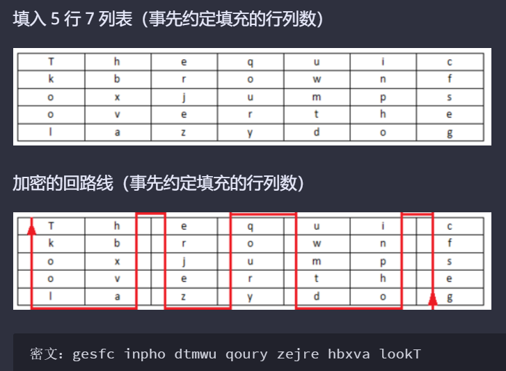
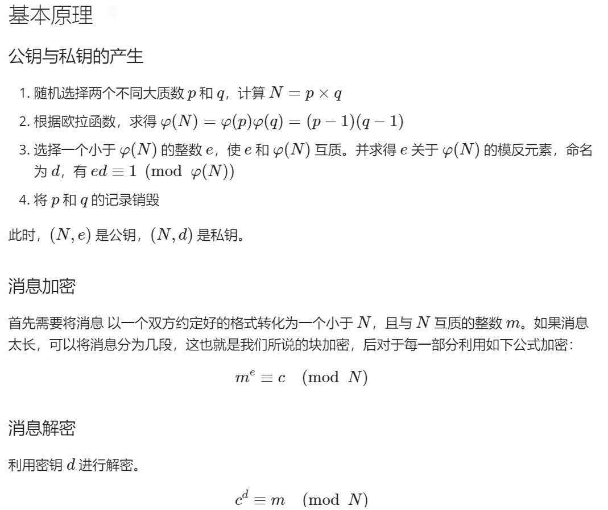
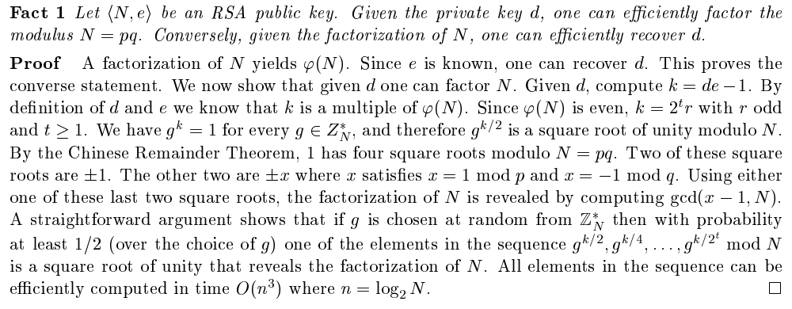
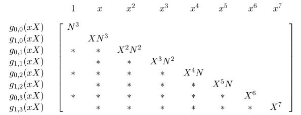
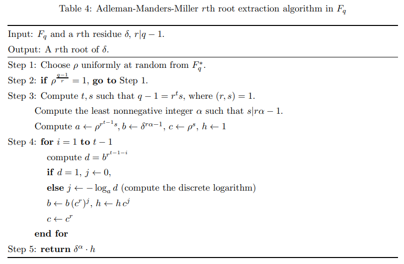

# Crypto
密码学（Cryptography）一般可分为**古典密码学**和**现代密码学**。

其中，**古典密码学**，作为一种实用性艺术存在，其编码和破译通常依赖于设计者和敌手的创造力与技巧，并没有对密码学原件进行清晰的定义。古典密码学主要包含以下几个方面：

- 单表替换加密（Monoalphabetic Cipher）
- 多表替换加密（Polyalphabetic Cipher）
- 奇怪怪的加密方式

而**现代密码学**则起源于 20 世纪中后期出现的大量相关理论，1949 年香农（C. E. Shannon）发表了题为《保密系统的通信理论》的经典论文标志着现代密码学的开始。现代密码学主要包含以下几个方面：

- 对称加密（Symmetric Cryptography），以 DES，AES，RC4 为代表。
- 非对称加密（Asymmetric Cryptography），以 RSA，ElGamal，椭圆曲线加密为代表。
- 哈希函数（Hash Function），以 MD5，SHA-1，SHA-512 等为代表。
- 数字签名（Digital Signature），以 RSA 签名，ElGamal 签名，DSA 签名为代表。

其中，对称加密体制主要分为两种方式：
- 分组密码（Block Cipher），又称为块密码。
- 序列密码（Stream Cipher），又称为流密码。

# 古典密码

#### 替换密码
http://quipqiup.com/

#### 维吉尼亚密码
* 解密工具
    * https://www.mygeocachingprofile.com/codebreaker.vigenerecipher.aspx 


#### Playfair
###### 原理 
Playfair 密码（Playfair cipher or Playfair square）是一种替换密码，1854 年由英国人查尔斯 · 惠斯通（Charles Wheatstone）发明，基本算法如下：

1. 选取一串英文字母，除去重复出现的字母，将剩下的字母逐个逐个加入 5 × 5 的矩阵内，剩下的空间由未加入的英文字母依 a-z 的顺序加入。注意，将 q 去除，或将 i 和 j 视作同一字。
2. 将要加密的明文分成两个一组。若组内的字母相同，将 X（或 Q）加到该组的第一个字母后，重新分组。若剩下一个字，也加入 X 。
3. 在每组中，找出两个字母在矩阵中的地方。
    * 若两个字母不同行也不同列，在矩阵中找出另外两个字母（第一个字母对应行优先），使这四个字母成为一个长方形的四个角。
    * 若两个字母同行，取这两个字母右方的字母（若字母在最右方则取最左方的字母）。
    * 若两个字母同列，取这两个字母下方的字母（若字母在最下方则取最上方的字母）。
新找到的两个字母就是原本的两个字母加密的结果。

以 playfair example 为密匙，得

```
P L A Y F
I R E X M
B C D G H
K N O Q S
T U V W Z
```
要加密的讯息为 ```Hide the gold in the tree stump```

```HI DE TH EG OL DI NT HE TR EX ES TU MP```
就会得到

```BM OD ZB XD NA BE KU DM UI XM MO UV IF```
>工具 
CAP4

#### Polybius
###### 原理 
Polybius 密码又称为棋盘密码，其一般是将给定的明文加密为两两组合的数字，其常用密码表
```
1	2	3	4	5
1	A	B	C	D	E
2	F	G	H	I/J	K
3	L	M	N	O	P
4	Q	R	S	T	U
5	V	W	X	Y	Z
```
举个例子，明文 HELLO，加密后就是 ```23 15 31 31 34```。

#### 培根密码
特点：
* 只有两种字符
* 每一段的长度为 5
* 加密内容会有特殊的字体之分，亦或者大小写之分。

#### 栅栏密码
原理：栅栏密码把要加密的明文分成 N 个一组，然后把每组的第 1 个字连起来，形成一段无规律的话。
本质上就是置换密码

#### 曲路密码
原理曲路密码（Curve Cipher）是一种置换密码，需要事先双方约定密钥（也就是曲路路径）


#### 列移位加密
本质上也是置换密码

#### 01248密码(云影密码)
该密码又称为云影密码，使用 0，1，2，4，8 四个数字，其中 0 用来表示间隔，其他数字以加法可以表示出 如：28=10，124=7，18=9，再用 1->26 表示 A->Z。

#### JSFuck
JSFuck 可以只用 6 个字符 []()!+ 来编写 JavaScript 程序。
> 工具 
JSFuck 在线加密网站 http://www.jsfuck.com/

#### BrainFuck
Brainfuck，是一种极小化的计算机语言
> 工具
https://www.splitbrain.org/services/ook

#### 猪圈密码

#### 舞动的小人密码
这些密码本质上是以一些符号代替英文字母，只要把英文字母替换上去就可解密，实质上可以使用词频分析

#### 键盘密码
所谓键盘密码，就是采用手机键盘或者电脑键盘进行加密。
##### 手机键盘密码
手机键盘加密方式，是每个数字键上有 3-4 个字母，用两位数字来表示字母
##### 电脑键盘棋盘
电脑键盘棋盘加密，利用了电脑的棋盘方阵
##### 电脑键盘坐标
电脑键盘坐标加密，利用键盘上面的字母行和数字行来加密
##### 电脑键盘 QWE
电脑键盘 QWE 加密法，就是用字母表替换键盘上面的排列顺序
##### 键盘布局加密
简单地说就是根据给定的字符在键盘上的样子来进行加密。
> 例：密文：```4esxcft5 rdcvgt 6tfc78uhg 098ukmnb```。试着在键盘上按照字母顺序描绘一下，可得到 ```0ops``` 字样

### 解题技巧
1. 如果遇到一段无脑的密文然后没有任何的提示，那么考虑替换密码，代换密码，哈希函数，直接上破解网站进行破解。
2. 一般如果是古典密码，一般都会给出一定的提示告诉我们使用的是哪一种古典密码。
3. 遇到给定的.py文件的题目，首先需要分析其主要运用的加密逻辑，与古典密码进行比较，若是一种新提出的方案，一般都会给出足够的信息作为突破口。


# 现代密码
## $\mathrm I$ 对称密码
## $\mathrm I.\mathrm I$ 流密码

#### 伪随机数生成器PRNG

##### 随机性的严格性 
* 随机性：随机数应该不存在统计学偏差，是完全杂乱的数列。
* 不可预测性：不能从过去的序列推测出下一个出现的数。
* 不可重现性：除非数列保存下来，否则不能重现相同的数列。

#### 码安全伪随机数生成器

#### 例题：woodman - Google CTF
```python
class SecurePrng(object):
    def __init__(self):
        # generate seed with 64 bits of entropy
        self.p = 4646704883L
        self.x = random.randint(0, self.p)
        self.y = random.randint(0, self.p)

    def next(self):
        self.x = (2 * self.x + 3) % self.p
        self.y = (3 * self.y + 9) % self.p
        return (self.x ^ self.y)
```
目标是要求出前100个随机数。
前面几个随机数很容易就可以知道，假设是sol1和sol2，因此可以写出相应的表达式，然后由于相乘的系数只为2和3，因此实际上求模的时候最多只会减去3个p，因此可以通过枚举减去的p的数量来猜测x0和y0的值。这里只要找出了两个明文就可以把x0和y0恢复出来。

> 首先需要模拟x和y模p是减去p的个数kx，ky

> 对于每一个候选比特串tx，都枚举0和1表示当前的第i bit，记为bi；把枚举出的bi添加到候选比特串的第i位中。然后把tx和sol1进行异或求出另一个比特串ty，再把tx和ty代入随机数生成的函数中(模p就使用减去kx和ky表示)，并把结果进行异或得到guess2，把guess2的低i位与sol2的低i位进行比较，如果相等，那么就把tx加入新一轮的候选，第i轮结束后，使用新一轮的候选覆盖第i轮的候选作为第i+1轮候选。

> 以此类推，直到所有bit都选择完毕，这样一来用最后剩下的候选进行测试，


#### 反馈移位寄存器

* $a_0, a_1, ... , a_{n-1}$位初态
* F 为反馈函数或者反馈逻辑。如果 F 为线性函数，那么我们称其为线性反馈移位寄存器（LFSR），否则我们称其为非线性反馈移位寄存器（NFSR）。
* $a_{i+n} = F(a_i, a_{i+1},...,a_{i+n-1})$

##### 线性反馈移位寄存器 - LFSR

##### B-M 算法 (一种求解线性反馈移位寄存器的算法)

#### 非线性反馈移位寄存器
* 非线性组合生成器，对多个 LFSR 的输出使用一个非线性组合函数
* 非线性滤波生成器，对一个 LFSR 的内容使用一个非线性组合函数
* 钟控生成器，使用一个（或多个）LFSR 的输出来控制另一个（或多个）LFSR 的时钟
代表 Geffe


## $\mathrm I.\mathrm I\mathrm I$ 块密码 TODO
所谓块加密就是每次加密一块明文，常见的加密算法有：
- IDEA 加密
- DES 加密
- AES 加密
- ARX 加密
- Simon and Speck 加密

还有许多对称加密方案，这里只列出常见的几种，每一种方法网上资料都比较多，这里就不一一列举。

在分组密码设计时，一般回使用**混淆(S盒，乘法)与扩散(线性变换，置换，移位)**两大策略。

### 分组模式
分组加密会将明文消息划分为固定大小的块，每块明文分别在密钥控制下加密为密文。当然并不是每个消息都是相应块大小的整数倍，所以我们可能需要进行填充。常见的分组模式：
- ECB：密码本模式（Electronic codebook）
- CBC：密码分组链接（Cipher-block chaining）
- PCBC：密码分组链接（Cipher-block chaining）
- CFB：密文反馈模式（Cipher feedback）
- OFB：输出反馈模式（Output feedback）
- CTR：计数器模式（Counter mode）

**注：ECB模式的AES是不安全的。**

### 填充方法
目前有不少的填充规则。常见的填充规则：
- **pkcs5**：填充字节数与填充字节数相同的值
- **pkcs7**：(OneAndZeroes Padding)Pad with 0x80 followed by zero bytes
- **Pad with zeroes except make the last byte equal to the number of padding bytes** 用零填充，并使最后一个字节等于填充字节的数目
- **null**：Pad with zero characters（零填充）
- **Pad with spaces**：空格填充

## $\mathrm I\mathrm I$ 非对称密码
## $\mathrm I\mathrm I.\mathrm I$ RSA


### RSA 相关攻击
***TITLE:***
1. 分解大整数N
2. 基本攻击
3. 小解密指数攻击
4. 小公钥指数攻击(Coppersmith's Theorem)
5. 选择明密文攻击
6. 侧信道攻击
7. 基于具体RSA实现的攻击
8. 实用小工具

***RSA Reference***：
1.  Boneh D . **Twenty Years of Attacks on the RSA Cryptosystem**[J]. Notices of the Ams, 2002, 46.
2. D. Boneh and G. Durfee. **New results on cryptanalysis of low private exponent RSA**[J]. Preprint, 1998.
3. Howgrave-Graham N , Seifert J P . **Extending Wiener's Attack in the Presence of Many Decrypting Exponents**[M] Secure Networking — CQRE [Secure] ’ 99. Springer Berlin Heidelberg, 1999.
4. Cao Z , Sha Q , Fan X . **Adleman-Manders-Miller Root Extraction Method Revisited**[J]. 2011.

#### 一、分解大整数N
目前最快的分解大整数N的方法是广义数域筛法(General Number Field Sieve)。对于n-bit的整数，时间为$O(exp((c+o(1))n^{\frac{1}{3}}log^{\frac{2}{3}}n))$

另一种分解大整数的方法：已知私钥$d$，和公钥$e$，则可快速对$N$进行分解。反之亦然，即已知$N$的分解$N=pq$，则可以快速恢复出$d$。

* 常见大整数$N$分解工具：
    * yafu (p,q相差过大或过小yafu可分解成功)
    * http://www.factordb.com

##### 1.1 已知 $(N, e, d)$ 求 $(p, q)$ V1
* 攻击条件，$e$或$d$比较小(不超过一亿)
* 攻击原理：$ed-1=k\varphi(N)$。因为$e$或$d$比较小，然后$\varphi(N)$与$N$比较接近，因此爆破$k$，从而找到$\varphi(N)$。然后由$$N=pq \newline \varphi(N)=(p-1)(q-1)$$得$$N-\varphi(N)+1=p+q$$接下来构造方程$$x^2+(N-\varphi(N)+1)x+N=(x-p)(x-q)=0 \tag{1.1}$$只需要解方程$(1.1)$就可以把$p$和$q$解出来。

* 代码参考 https://blog.csdn.net/ayang1986/article/details/112714749
* ***具体python2代码见``crypto/code/Known_ed_factor_N_V1.py``*** 

##### 1.2 已知 $(N, e, d)$ 求 $(p, q)$ V2
* 没有攻击条件的限制
* 分解原理：

**TODO:中间有个小细节不太懂，需要弄清楚一点**

* 代码参考 https://blog.csdn.net/ayang1986/article/details/112714749
* ***具体python2代码见``crypto/code/Known_ed_factor_N_V2.py``*** 

#### 二、基本攻击
##### 2.1. N不互素
给定两个N1，N2，若不互素，则其gcd(N1,N2)就是其中一个p或q。因此直接被破解。

##### 2.2 共模攻击(Common Modules)
当两个用户使用相同的模数 N、不同的私钥时，加密同一明文消息M，此时可以使用此攻击。
设两个用户的公钥分别为$e_1$和$e_2$，且两者互质。明文消息为$m$，密文分别为
$$
c_1 = m^{e_1}\ mod \ N \newline 
c_2 = m^{e_2}\ mod \ N
$$
截获$c_1和c_2$后，计算$re_1+se_2=1\ mod \ n$中的$r$和$s$，则$m^{re_1+se_2}\ mod\ n\equiv m\ mod\ n$

##### 2.3 盲化攻击(Blinding)
Bob有私钥<N,d>，公钥<N,e>。敌手Alice想要Bob对M进行签名，但是Bob不会对M签名。于是Alice计算$M'=r^eM\ mod\ N$。然后Bob就会对M'进行签名得到S'，则有$$S'=r^{ed}M^d\ mod\ N = rM^d\ mod\ N$$因此$$S=S'/r\ mod\ N=M^d\ mod\ N$$。

##### 2.4 已知$dp\equiv d\ mod\ (p-1)$
已知$$d_p\equiv d\ mod\ (p-1)\newline ed\equiv 1\ mod\ (p-1)(q-1)$$有$$d_p=k(p-1)+d \newline ed=k'(p-1)(q-1)+1$$则有$$ed_p-1=(p-1)(ek+k'(q-1))$$因为$$0\leq ed_p-1\leq ep$$因此$$0\leq (p-1)(ek+k'(q-1))\leq ep \newline 0\leq (ek+k'(q-1))\leq e+1$$因此遍历$i\in[0,e]$若发现$N$能被$(ed_p-1)/i+1$整除，则$p=(ed_p-1)/i+1$。

#### 三、小解密指数攻击
##### 3.1 Wiener’s attack
* **Theorem 2 (M. WIener)：** 让$ N=pq, q<p<2q $，并且有$d<\frac{1}{3}N^{\frac{1}{4}}$。给定公钥<N,e>，则有一个有效的方法恢复出私钥d。
* 证明：此定理是基于连分数的近似。易得
$$|\frac{e}{\varphi(N)}-\frac{k}{d}|=\frac{1}{d\varphi(N)} \newline
\varphi(N)=N-p-q+1 \newline
k<d<\frac{1}{3}N^{\frac{1}{4}}
$$
因此有
$$
|\frac{e}{N}-\frac{k}{d}|\leq\frac{1}{2d^2}
$$
根据
可知$\frac{e}{N}$的**连分数的收敛式**中有一项为$\frac{k}{d}$。**连分数的收敛式(Convergent)** 的定义：记为$c_i$。令$n$表示连分数最多展开$n$层。即$$a=a_0+\frac{1}{a_1+\frac{1}{\ddots +\frac{1}{a_n}}}简写为a=[a_0;a_1,a_2,...,a_n]$$则连分数的收敛式$c_i$满足$$\forall x\in[0,n],\ c_i=[a_0;a_1,...,a_i]$$ 因此只需要对$\frac{e}{N}$进行连分数展开，找出满足$$ed-1\ mod\ k = 0 \tag{3.1}$$的收敛式$\frac{k}{d}$，即$\exists i'\in[0,n],c_{i'}=\frac{k}{d}$，则$$\phi(n)=\frac{ed-1}{k}$$可能会出现当d比较小的时候$(3.1)$式成立，因此需要进行特殊的判别。

* 避免此类攻击的方法
    * 选择比较大的公钥$e$，$e>1.5N$。[这样以来k就会变大]
    * 使用中国剩余定理设定两个私钥$d_p, d_q$，一个mod p一个 mod q,这样解密速度会变快，并且通过中国剩余定理恢复出来的d会很大。

Boneh and Durfee [D. Boneh and G. Durfee.New results on cryptanalysis of low private exponent RSA. Preprint, 1998.]等人提出当$d<N^{0.292}$时敌手也能快速恢复出私钥d。

* 3.1节代码参考 https://www.cnblogs.com/Guhongying/p/10145815.html

* ***具体python2代码见``crypto/code/Wieners_Attack.py``*** 在代码中给出$e,n$可恢复出私钥指数$d$。

##### 3.2 Extending Wiener's Attack

原理：对于同一个$N$，有$i, i>1$个公钥指数$e_i$，所有$e_i$所对应的私钥指数$d_i$都比较的小。此时可以使用Extending Wiener's Attack进行求解。下面给出当$i$比较小时$d_i$所取的范围。我们令$d_i< N^{\alpha}$，则$i$与$\alpha$的关系为(一般情况比较的复杂，这里只列举$i$比较小的情况)：
$i$|$\alpha$
:-:|:-:
2|$< 5/14-\epsilon'$
3|$< 2/5-\epsilon'$
4|$< 15/34-\epsilon'$

具体思路：令$$g = gcd(p-1,q-1)$$易得$$deg=k(p-1)(q-1)+g$$令$$s=1-p-q$$记方程$W_i$为$$e_id_ig-k_iN=g+k_is \tag{Wi}$$。对于两个公钥指数的情况，有$$e_1d_1-k_1\varphi(N)=1 \newline e_2d_2-k_2\varphi(N)=1$$上式乘$k_2$减去下式乘$k_1$得$$e_1d_1k_2-e_2d_2k_1=k_2-k_1 \tag{G(1,2)}$$计算可得$W_1W_2$同样也是一个等式。由式$$k_1k_2=k_1k_2 \newline W_1*k_2 \newline G_{(1,2)} \newline W_1*W_2 $$四个等式可以构造如下等式$$A*L_2=B_2$$其中$$A=(k_1k_2,d_1gk_2,d_2gk_1,d_1d_2g^2)$$

其中$L_2$矩阵都是已知的项构成的，我们可以把$L_2$看作一个格，然后$B_2$是其最短向量，使用**LLL定理**（见4.1节）可以求出其最短向量。而且若$B_2$为最短向量，则需要满足$||B_2||\leq \sqrt{n}det(L)^{\frac{1}{n}}$，即$$2N^{1+2\alpha}\leq 2N^{(\frac{13}{2}+\alpha)\frac{1}{4}}$$解得$\alpha\leq \frac{5}{14}$从而可以代入$M_2$中。(**编程实现的过程中可稍微缩小$\alpha$使得LLL算法必定有解**)求出最短向量$B_2$后，计算$B_2*L_2^{-1}$得到A。然后用a的前两项计算$$\frac{a[1]}{a[0]}e_1 = \frac{e_1d_1g}{k_1} = \varphi(N)$$从而把$\varphi(N)$恢复出来。

* 代码参考：https://blog.csdn.net/jcbx_/article/details/109306542
* ***具体Sagemath9.2代码见``crypto/code/Extended_Wieners_Attack.py``*** 在代码中提供$\alpha,e_1,e_2,n$可恢复出$\varphi(N)$


#### 四、小公钥指数攻击(Coppersmith's Theorem)
##### 4.1 攻击原理
***本质上是当公钥指数较小$e\leq 5$，把问题变成求解$f(x)\equiv 0\ mod\ N$的问题，其中$f(x)=\sum_{i=0}^{e} a_ix^i，a_i\in Z_N$。主要应用场景在e很小，方程的根比较小的情况。***
* **Theorem 3 (Coppersmith)：** $N$是整数，$f\in Z[x]$是度数为**d**的首一多项式。令$X=N^{\frac{1}{d}-\epsilon}$*（$X$是实数）*。则给定$<N,f>$，敌手可以快速找出所有的整数$\{x_0|\ \ |x_0|<X\ 且\ f(x_0)\equiv 0\ mod\ N\}$。运行时间为运行*LLL*算法所花费的时间，记为$O(w), w=min(1/\epsilon,log_2 N)$
* **Coppersmith方法**主要通过找到与$f\ mod\ N$有 **(1.相同根 2.系数为整数域 3.系数更小)** 性质的多项式$g$，从而找出$g$的根(因为容易找出整数域上的多项式根)
    * $f到g$的转换方式：预定义一个整数m，定义$$g_{u,v}(x)=N^{m-v}x^uf(x)^v$$。因此$x_0$是$g_{u,v}(x)\ mod\ N^m$的一个根，其中$u\geq 且0\leq x_0\leq m$与此同时有$f(x_0)\equiv 0\ mod\ N$
    * 因此我们可以找到一组$g_{u,v}$的线性组合$h(x)$，满足$h(xX)$有小于$N^m$的范式(根)，其中$X$是$x_0$中满足$X<N^{\frac{1}{d}}$的上界。只要m足够大，那么一定能找到这样的$h(x)$。**此时表示我们找到了这样的$h(x)$，它在整数中有同样的根$x_0$**。
##### $h(x)$的寻找方法
* 定义$h(x)=\sum a_ix^i \in Z[x]$，则$\|h(x)\| = \sum a_i$
* **Lemma 4 (Howgrave-Graham)：** Let $h(x)\in Z[x]$ be a polynomial of degree $dg$ and let $X$ be a positive integer. Suppose $\|h(xX)\| < N/\sqrt{dg}$. If $|x_0| < X$ satisfies $h(x_0)=0\ mod\ N$, then $h(x_0)=0$ holds over the integer.（$h(x_0)=0$在整数上成立）
    * 首先我们把多项式$g_{u,v}(xX)$作为向量，并记格$L$是由它所生成的。固定一个m，我们就可以写出格$L$的表达式，形如下图。其中带``*``号的表示非0系数，空的位置代表0。下图是当$m=3,dg=2$时所构造出的格$L$。
    
    * 通过**LLL定理**，可以找出格L中的一个向量$v\in L$，满足$\|v\|\leq 2^{w/4}det(L)^{1/w}$，w表示格的维数。接下来需要证明：$2^{w/4}det(L)^{1/w} < N^m/\sqrt{w}，其中w=dg(m+1)$。当m足够大的时候，上式可以被满足。因此通过LLL定理找出的向量$v$就是所求的$h(x)$。
    * 参数的确定:当由$X=N^{\frac{1}{dg}-\epsilon}$时，有$m=O(k/dg)，k=min(\frac{1}{\epsilon},log\ N)$

**LLL定理：** Let L be a lattice spanned by $<u_1,...,u_w>$. When $<u_1,...,u_w>$ are given as input, then the LLL algorithm outputs a point $v\in L$ satisfying $$\|v\|\leq 2^{w/4}det(L)^{1/w}$$ LLL的运行时间是输入长度$w$的四次方。
* **Coppersmith定理所使用的攻击方法一般都被写在了``Magma``的``SmallRoots``函数中，以及``SageMath``的``small_root``函数中。**
* 详细实现过程参考：https://github.com/mimoo/RSA-and-LLL-attacks

##### 4.2 Hastad的广播攻击
假设$e=3$，并且加密者使用了三个不同的模数$n_1,n_2,n_3$给三个不同的用户发送了加密后的消息$m$: $$c_1=m^3\ mod\ n_1 \newline 
c_2=m^3\ mod\ n_2 \newline 
c_3=m^3\ mod\ n_3$$
其中$n_1,n_2,n_3$不互素，$m < n_i$。
* 攻击方法：首先通过中国剩余定理得到$m^3\equiv C\ mod\ n_1n_2n_3$。因此只要对$C$开三次根就可以得到$m$的值。开根可以使用``SageMath``中的``iroot``函数。
    * 代码参考：https://github.com/yifeng-lee/RSA-In-CTF/blob/master/exp2.sage
    * ***具体Sagemath9.2代码见``crypto/code/Hastad_Broadcast_Attact.sage``***
* **拓展：** 具有线性填充的广播攻击也能通过Coppersmith's Theorem被攻破。
* 因此广播攻击的避免方式可以使用随机填充(padding)

##### 4.3 Franklin-Reiter 相关信息攻击
(**Franklin-Reiter**)当 Alice 使用同一公钥对两个具有某种线性关系的消息 M1 与 M2 进行加密，并将加密后的消息 C1，C2 发送给了 Bob 时，我们就可能可以获得对应的消息 M1 与 M2。这里我们假设模数为 N，两者之间的线性关系为$M_1\equiv f(M_2)\ mod\ N，f=ax+b$。则此时可以比较容易地恢复出$M$。
* 方法：当e=3时，$C_1=M_1^e\ mod\ N$，则有$M_2$是$g_1(x) = f(x)^e - C_1\equiv 0\ mod\ N$的根，而且$M_2$也是$g_2(x)=x^e - C_2\equiv 0\ mod\ N$的根。如果$g_1,g_2$的最大公因子是线性的，那么$M_2 = gcd(g_1,g_2)$。
* 当e>3时，$g_1,g_2$不一定是线性的，此时无法用此方法求解。
##### 4.4 Coppersmith’s short-pad attack （短填充攻击）
假设N长度为n，令$m=\lfloor n/e^2\rfloor$，加密消息M的长度不超过(n-m) bits。若有$$M_1=2^mM+r_1 \newline M_2=2^mM+r_2$$$0\leq r_1,r_2\leq 2^m$是不同的整数，则若知道$e,M_1,M_2,C_1,C_2$，容易恢复出M。
* 令$$g_1(x,y)=x^e-C_1 \newline g_2(x,y) = (x+y)^e-C_2$$ 
其中$y=r_2-r_1$，则$M_1$是两个方程的根。因此有$M_1=gcd(g_1(x,y),g_2(x,y))$，过程：


* 当padding的长度小于信息长度的1/9的时候，可以使用此攻击。
##### 4.5 Known High Bits Message Attack(已知高比特信息攻击)
已知$C\equiv m^e\ mod\ N$，假设已知很大一部分$m_0$,则有$C\equiv(m_0+x)^e\ mod\ N$。直接使用Coppersmith定理求解$x$，但记得其中的$x$需要满足Coppersmith定理中的约束，即$x < N^{\frac{1}{e}}$。

* ***具体Magma代码见``crypto/code/Known_High_Bits_Message_Attack.m``***

##### 4.6 Factoring with High Bits Known(已知高比特分解)
已知$p$或$q$中其中一个数的高位比特，我们就有一定几率来分解 $N$。
**这里的原理就是Theorem 10，但是原理的具体流程没有找到。这里只是使用现成的代码能做到已知p的高比特部分，代码运行之后能得到相应的$p$。**
原理则是求解$x+p_{fake}\equiv 0\ mod\ Factor(N)$，Sage里面恰好有这样的一个函数，可以直接使用。

* 代码参考：https://github.com/yifeng-lee/RSA-In-CTF/blob/master/exp6.sage
* ***具体Sagemath9.2代码见``crypto/code/Factoring_with_High_Bits_Known.py``***

##### 4.7 Partial Key Exposure attack （部分密钥泄露攻击）
此时公钥$e$很小
* **Theorem 9 (BDF)：** 给定私钥<$N,d$>，$N$长为$n$比特，并给出私钥d的$\lceil n/4\rceil$位最低有效位(即$d$的低位)，那么可以在时间$O(elog_2\ e)$中恢复出$d$。
* **Theorem 10 (Coppersmith)：**$N=pq$，N为n比特。给出私钥p的高或低n/4比特，那么可以快速分解N。

我们主要讨论定理10，

**原理：** 首先已知$ed-k(N-p-q+1)=1$，因为$d<\varphi(N)$，所以有$0< k\leq e$。然后又因为$q=N/p$。则有$$(ed)p-kp(N-p+1)+kN=p\ mod\ (2^{n/4})$$因为敌手Marvin得到了$d$的$n/4$个最低有效位$d_0$，所以他知道$ed\equiv ed_0\ mod\ 2^{n/4}$。因此，他得到了一个关于$k$和$p$的方程。对于$k$的每一个可能的值$[0,e]$，Marvin求解了关于$p$的二次方程$$(ed_0)x-kx(N-x+1)+kN=x\ mod\ (2^{n/4})$$得到了一些$p$的候选值$x\ mod\ 2^{n/4}$的候选值。对于每一个候选值，执行定理10的算法(**4.6节**)去尝试分解$N$。可以看出，对于$p\ mod\ 2^{n/4}$的候选值的总数最多为$elog_2\ e$。因此，最多尝试$elog_2\ e$次后，$N$将被因式分解。然后就可以通过$e$和$\varphi (N)$求出私钥$d$。
* 定理10的代码见4.6节。

* 代码参考：https://github.com/yifeng-lee/RSA-In-CTF/blob/master/exp8.sage
* ***具体Sagemath9.2代码见``crypto/code/Partial_Key_Exposure_attack.py``***

##### 4.8 Boneh and Durfee attack
当 $d$ 较小时，满足 $d < N0.292$ 时，我们可以利用该攻击，比 Wiener's Attack 要强一些。

* 注意：4.2~4.7节的公钥指数$e$都是非常小(一般为3)。而本节仅仅是私钥指数$d$比较的小，而一般假设$e$非常的大。

###### 4.8.1 攻击原理
假设$gcd(p-1, q-1)=2$，已知$\varphi(N)=N-p-q+1$，则有
$$ed\equiv 1\ mod\ \varphi(N)/2$$
$$ed+k(\frac{N+1}{2}-\frac{p+q}{2})=1$$
令$A=\frac{N+1}{2}, s=-\frac{p+q}{2}$，则有$$k(A+s)\equiv 1\ (mod\ e)$$
而且满足$|k|< e^{\delta}$以及$|s|< e^{0.5}$，其中$\delta < 0.292$
这里$k$和$s$是未知数，因此我们相当于求一个二元二次方程的解。这里用到的是Coppersmith算法的广义的形式。

* 代码参考：https://github.com/mimoo/RSA-and-LLL-attacks/blob/master/boneh_durfee.sage
* ***具体Sagemath9.2代码见``crypto/code/boneh_and_durfee.sage``***

##### 4.9 低加密指数攻击
$m ^ e = kN + c$其中一般 $e = 3$，$k$比较小($k$小于10亿爆破时间一般小于半小时)

##### 4.10 公钥$e$与$\varphi(N)$不互素
* 攻击前提：$p,q$已知，$e$比较小(不超过65535)
但是由于$e$与$\varphi(N)$不互素，所以我们无法求解得到私钥$d$。只有当他们互素时，才能保证$e$的逆元$d$唯一存在。
###### 4.10.1 $e \nmid \varphi(N)$
一般情况下会对同一个信息$m$给出两对$c_1,e_1,n_1,c_2,e_2,n_2$信息，且$n_1 = pq_1$、$n_2=pq_2$。于此同时还有$$gcd(e_1,(p-1)*(q_1-1)) = gcd(e2,(p-1)*(q_2-1)) = b$$然后令$e_i=a_ib$则$a_i$与$\varphi(N)$互素，又因为$ed\equiv 1\ mod\ \varphi(N)$因此每个$a_i$都唯一确定一个$bd_i$，则有$c_i^{bd_i} \equiv m^b\ mod\ N$记$c_i^{bd_i}=res_i$从而我们可以得到$$res_1 \equiv m^b\ mod\ n_1 \newline res_2 \equiv m^b\ mod\ n_2$$展开得$$res_1 \equiv m^b\ mod\ p \newline res_1 \equiv m^b\ mod\ q_1 \newline res_2 \equiv m^b\ mod\ q_2$$通过中国剩余定理计算可得$$res \equiv m^b\ mod\ q_1q_2$$此时求出$b' = gcd(b,q_1q_2)$，$d'=e/b'$，$d'd'^{-1}\equiv 1\ mod\ \varphi(q_1q_2)$，则$$res^{d'^{-1}} \equiv m^{bd'^{-1}} \equiv m^{b'}\ mod\ q_1q_2$$一般来说$b'$为2，此时$res^{d'^{-1}}$已知，因此之需要开个平方就可以得到$m$，**若$b'$不为2，则相当于变成了4.10.2节的情况**。

###### 4.10.2 $e\ |\ \varphi(N)$
现在相当于是这样的一种情况，我们有这样的一个方程$$c\equiv m^e\ mod\ N \tag{4.10}$$，其中$c,N,e,p,q$已知，需要求$m$。但是此时有$e | \varphi(N)$。因此这个方程可以化为$$c\equiv m^e\ mod\ p \newline c\equiv m^e\ mod\ q$$因为$e$与$p,q$互素，因此两个方程各有$e$个根，从而方程$(4.10)$有$e^2$个根。我们的目的就是找到这$e^2$个根中我们需要的那个，**就是找到有特殊字符串开头比如``flag{``开头的根$m$**。

* 主要流程：
    1. 用**Adleman-Manders-Miller rth Root Extraction Method**在GF(p)和GF(q)上对$c$开$e$次根，分别得到一个解。
    2. 找到所有的$e$个primitive $e^{th}$ root of 1，乘以上面那个解，得到所有的$e$个方程$c\equiv m^e\ mod\ p$和方程$c\equiv m^e\ mod\ q$的解.
    3. 用**中国剩余定理CRT**对GF(p)和GF(q)上的两组$e$个解组合成$mod\ N$下的解，可以得到$e^2$个方程$(4.10)$解。

**Adleman-Manders-Miller rth Root Extraction Method （AMM）**

https://arxiv.org/pdf/1111.4877.pdf  **Cao Z , Sha Q , Fan X . Adleman-Manders-Miller Root Extraction Method Revisited[J]. 2011.** 这篇文章里给出了算法的推导过程，由于稍微有点复杂，就不写在这里了。
更详细的解释可参考 https://blog.csdn.net/jcbx_/article/details/105303760 这篇博客。

题外话：其实开n次方根的方法还有很多，这只是其中一种比较好理解和实现的。

**找出所有的$e$个primitive $e^{th}$ root of 1**：一种不严谨的做法就是随机生成$e$个$GF(p)$上的数记$x_i,\ i\in[1,e]$，然后计算$x^{\frac{p-1}{e}}\ mod\ p = x_i$，这样一来每个$x_i^e \equiv 1\ mod\ p$。不严谨就在于可能会出现重复的现象。

进而只要用AMM算法求出的$c$在$GF(p)$上的$e$次根记$m_p$，则计算$m_p·x_i\ mod\ p$就得到所有的$e$个方程$c\equiv m^e\ mod\ p$的解。

* 代码参考：https://blog.csdn.net/cccchhhh6819/article/details/112766888 本质上这里的代码是参考starctf2021_Crypto_little_case题目中的writeup。
* ***具体Sagemath9.2代码见``crypto/code/AMM.sage``***


#### 五、选择明密文攻击
##### 5.1 选择明文攻击
* 前提：我们有一个Oracle，对于给定任意明文，Oracle都会给出相应的密文。
* 目标：获取公钥N，e
    1. 首先通过构造多对加解密获取N。
    2. 当$e < 2^{64}$时，用 Pollard’s kangaroo algorithm 算法获取公钥$e$。

##### 5.2 选择密文攻击
* 前提：我们有一个Oracle，对于任意的合法密文，Oracle都会给出相应的明文(相当于时攻击者临时获得了解密机器的访问权)。但是我们不知道密钥。
* 目标：Alice计算$C=m^e\ mod\ N$，把Alice用自己的公钥签名的信息$m$恢复出来。
    1. 选择任意$X\in Z_N^*$
    2. 计算$Y=CX^e\ mod\ N$
    3. 想办法让Alice计算$Z = Y^d\ mod\ N$
    4. $m = ZX^{-1}\ mod\ N$

此攻击并没有把Alice的私钥恢复出来，本质上是对RSA协议本身的攻击而不是算法的攻击。

##### 5.3 RSA parity oracle
假设目前存在一个 Oracle，它会对一个给定的密文进行解密，并且会检查解密的明文的奇偶性，并根据奇偶性返回相应的值，比如 1 表示奇数，0 表示偶数。那么给定一个加密后的密文，我们只需要 log(N) 次就可以知道这个密文对应的明文消息。

Oracle返回奇偶性信息造成了信息的泄露，因此可以使用选择明文攻击的思路进行攻击，具体的攻击方案见：https://ctf-wiki.org/crypto/asymmetric/rsa/rsa_chosen_plain_cipher/

* 本质上是二分法，然后夹逼。

##### 5.4 RSA Byte Oracle
假设目前存在一个 Oracle，它会对一个给定的密文进行解密，并且会给出明文的最后一个字节。那么给定一个加密后的密文，我们只需要$log_{256}N$次就可以知道这个密文对应的明文消息。

具体方案同样见：https://ctf-wiki.org/crypto/asymmetric/rsa/rsa_chosen_plain_cipher/

##### 5.5 RSA parity oracle variant
如果 oracle 的参数会在一定时间、运行周期后改变，或者网络不稳定导致会话断开、重置，二分法就不再适用了，为了减少错误，应当考虑逐位恢复。

TODO：未完善

#### 六、侧信道攻击
侧信道攻击：攻击者能获取密码设备中的侧信道信息(例如能量消耗、运算时间、电磁辐射等等)从而获取密码信息。

攻击条件：密码实现的过程中侧信道信息泄露，能从侧信道信息中获取加密过程的信息，从而分析出明文。

详细例子见：https://ctf-wiki.org/crypto/asymmetric/rsa/rsa_side_channel/

#### 七、基于具体RSA实现的攻击
##### 7.1  Bleichenbacher's Attack on PK CS 1
即在PKCS 1(Public Key Cryptography Standard 1)中实现时可以找出实现时的漏洞，然后相当于敌手获得一个oracle，使得敌手可以不断猜测一个伪造的签名，知道猜测成功。

这种攻击主要针对PKCS 1实现时的攻击。

***注：这里只提供理论支撑，详细例子见crypto文件夹中的各个writeup。其实有一部分理论我也不是很清楚，特别是Coppersmith方案中的方法。要做几道题来再搞清楚一下其细节的方案，特别是***
1. ***Coppersmith方案解方程的实现***
2. ***部分密钥泄露攻击***
3. ***Boneh and Durfee attack***

#### 八、实用小工具
* RSA工具集-openssl,rsatool,RsaCtfTool
参考：https://www.jianshu.com/p/c945b0f0de0a
    * openssl可以实现：秘钥证书管理、对称加密和非对称加密。一般来说Windows有自带的，Ubuntu中apt可以方便地下载。
    * 根据给定的两个素数（p，q）或模数和私有指数（n，d）来计算RSA（p，q，n，d，e）和RSA-CRT（dP，dQ，qInv）参数。 https://github.com/ius/rsatool
    * RsaCtfTool:RSA多重攻击工具，从弱公钥解密数据并尝试恢复私钥针对给定的公钥自动选择最佳攻击。 https://github.com/Ganapati/RsaCtfTool


## $\mathrm I\mathrm I.\mathrm I\mathrm I$ 背包加密 TODO

## $\mathrm I\mathrm I.\mathrm I\mathrm I\mathrm I$ 离散对数 TODO

### 一 ElGammal

### 二 ECC

## $\mathrm I\mathrm I.\mathrm I\mathrm V$ 格密码 TODO


# 哈希函数

# 数字签名

# 常见Crypto攻击思想

常见攻击方法 ¶
根据不同的攻击模式，可能会有不同的攻击方法，目前常见的攻击方法主要有

* 暴力攻击（通用）
* 中间相遇攻击（思想）
* 线性分析（常用于缺陷版AES）
* 差分分析（常用于缺陷版AES）
* 不可能差分分析
* 积分分析
* 代数分析
* 相关密钥攻击
* 侧信道攻击
* 比特攻击